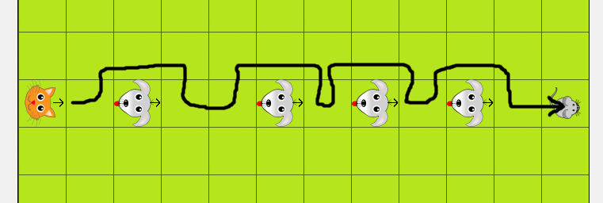

# Opdrachten methodes (vervolg)
Download het `Kitty-Les3` scenario (op Magister). Kijk even rond naar welke methodes de kat kan gebruiken (Kijk daarbij ook naar de superklassen van kat, namelijk Actor en Animal. Kitty kan die ook gebruiken). De methodes die we vooral gaan gebruiken tijdens deze les zijn: `move()` en `turnLeft()`.

1. Zoals je kunt zien is er alleen een `turnLeft()` methode en geen `turnRight()` methode. Probeer zelf een `turnRight()` methode te maken, door alleen gebruik te maken van `turnLeft()`. Wat zijn de return-type en parameters van deze methode?

2. Doe hetzelfde voor een methode `turnAround()` waarbij de kat 180 graden draait.

3. Schrijf Javadoc documentatie voor je zelfgemaakte methodes.

4. Probeer nu methodes te schrijven voor de volgende taken: `spin()` (draai in een rondje van 2x2 tegels) en `sprint()` (loop 2 vakken vooruit).

5. Probeer nu de kat de volgende route te laten volgen. Doe dit in de `act()` methode.

# EXTRA
1. Probeer een [if-statement](https://www.w3schools.com/java/java_conditions.asp) te gebruiken om de kat automatisch de hond te laten ontwijken.